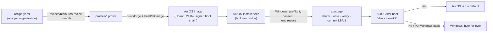

# AurOS

**An old Windows PC, turned into a patched Linux desktop by one download and one restart — and
put back exactly as it was if the person changes their mind.** (The installer checks the PC first
and stops, changing nothing, if Windows is hibernated or the firmware will only start Windows.)
For schools and nonprofits: the same machine, built from one short `recipe.yaml` per organisation.

This repository is the merge of two earlier attempts at AurOS:

| | Came from | What it contributes |
|---|---|---|
| **The engine** (repo root) | `auros-from-scratch` (2026-10-04) | The thing that actually runs: the Windows installer (AurBridge), the one-restart staging environment that shrinks Windows and writes AurOS, the way back, the Ubuntu 24.04 image and its boot chain, the desktop shell, file migration. |
| **The discipline and the business** (`recipes/`, `tools/honesty-gate.mjs`, `hardware/`, `./verify`) | LATHE (2026-09-21, archived in [`lathe/`](lathe/)) | Per-organisation recipes compiled into engine profiles, the honesty gate that fails the build on an unevidenced website claim, `hardware/compat.tsv` as the only record of real machines, and one command that runs every check and cannot report green over a failure. What was adopted and what was not, and why: [`lathe/ADOPTED.md`](lathe/ADOPTED.md). |



## Where it stands (2026-10-05)

**Proven in this repository, by tests that fail when the thing they check is broken.** Everything
below ran in a cloud container (Ubuntu 24.04, QEMU without KVM, OVMF with Microsoft's keys and Secure
Boot on). Summary and transcripts: [`docs/results/2026-10-container/SUMMARY.md`](docs/results/2026-10-container/SUMMARY.md).

| What | Evidence |
|---|---|
| Install, start AurOS, put Windows back twice, every Windows file identical | `installtest` 37/37 |
| The same with no memory stick | `nosticktest` 45/45 |
| Firmware alone starts the installed AurOS, Secure Boot enforced | `loadertest` 18/18 |
| Power cut at each of 18 named instants of install and restore; Windows comes back | `powercuttest` 138/138 |
| Ten machine shapes (4Kn, OEM ESP, MBR, BIOS, BitLocker, hibernated, two Windows, no room…) accepted or refused correctly | `matrixtest` 10/10 |
| The real image's first boot, its question, and the answer carried out in firmware variables | `firstboottest` 32/32, `choicesboottest` 9/9 |
| "Put Windows back" from the button in AurOS to the restore | `putbacktest` 16/16 |
| Kernel, grub and shim security updates keep it booting | `bootupdatetest` 27/27, `bootchaintest` 72/72 |
| A desktop that cannot start says so in words | `failtest` |
| The dry run, refusals, and the disk byte-for-byte unchanged after each | `stagetest` 34/34 |
| Recipes, honesty gate, compat lint, every script's syntax, the fast C unit tests | `./verify` — 27 passed, 0 failed |

**Not proven: a real PC.** Zero real machines have been installed (`hardware/compat.tsv` has no
rows, and the honesty gate holds the website to that). The installer has been started on real
Windows in CI before (`.github/workflows.parked/windows.yml`), never run to the end on real hardware.
That is the next piece of evidence that changes anything — see [`docs/TRY-IT.md`](docs/TRY-IT.md).

**Not a code problem:** a code-signing certificate (SmartScreen warns until then), a host for the
image, and a legal entity. [`docs/RELEASE.md`](docs/RELEASE.md), [`docs/SIGNING.md`](docs/SIGNING.md).

## Run it

```sh
./verify                                   # every fast check; exits non-zero if anything failed
sudo sh tools/container-deps.sh            # toolchain on a fresh Ubuntu 24.04 (root)
sh tools/e2e-all.sh OUTDIR [test…]         # the QEMU end-to-end tests (needs a built out/)

node recipes/bin/auros-recipe explain recipes/examples/example-school.yaml
node recipes/bin/auros-recipe compile recipes/examples/example-school.yaml -o profiles/example-school.profile
sudo ./build/forge build example-school && sudo ./build/mkimage example-school
```

The website is static: `cd website && python3 -m http.server`. Design alternatives the owner can
compare are in `website/directions/`.

## Map

```
build/      forge (image) · mkimage · staging · aurbridge (the .exe) · sign · all
src/        aurbridge (Windows installer) · aurstage (the restart) · aurscreen · aurfirst
            aurshell + aurwl (desktop, Wayland compositor) · aurora (themes) · ferry (migration)
            recovery · aurinit · common
recipes/    recipe.yaml → profile: lib/recipe.mjs (also runs in the browser), bin/, examples/, test/
profiles/   desktop · office · revive · school-kiosk · multilingual · example-* (compiled from recipes)
rootfs/     what goes into the image, including the boot chain (usr/lib/auros/bootchain)
themes/ shells/   six themes, six desktop layouts
tools/      every test; honesty-gate, compat-lint, unit-all, e2e-all, container-deps
hardware/   compat.tsv — real machines only
website/    the site (Aurora), safety page, directions board, archive of the old "page is the drive"
docs/       PLAN · AURBRIDGE · STAGEC · RELEASE · SIGNING · THEMING · FERRY · results/ · research/
lathe/      the LATHE control repo, archived; ADOPTED.md says what came across
```

More: [`HANDOFF.md`](HANDOFF.md) (start here if you are picking this up),
[`README.fromscratch.md`](README.fromscratch.md) (the engine in depth),
[`docs/research/red-team.md`](docs/research/red-team.md) (read before trusting it with a disk).

## Licence

The engine is MIT ([`LICENSE`](LICENSE)). LATHE was all rights reserved ([`lathe/LICENSING.md`](lathe/LICENSING.md)). <!-- auros-allow: describes the archived LATHE licence, not this repository's -->
Which one the merged product carries is the owner's decision; until it is made, the root `LICENSE`
governs this repository and the honesty gate checks every licence claim against it.
